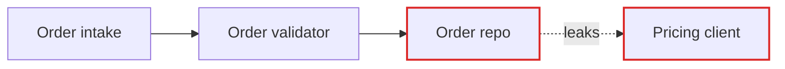

# The report — Artifact format

The survey's deliverable is a single self-contained Artifact. Load the `artifact-design` skill before writing it, and `artifact-diagramming` for the before/after visuals; this file covers only what's specific to an architecture review.

**Adapted for Artifacts, not copied.** The upstream version writes a temp-dir HTML file pulling Tailwind and Mermaid from CDNs. Artifacts run under a strict CSP — **no CDN stylesheets or scripts load** (Google Fonts is the sole exception). So: inline every rule, and use Artifacts' native Mermaid rendering (a `<pre class="mermaid">` block, no import, no init script). What survives from upstream is the editorial style and the diagram vocabulary, which is the part that matters.

Publish with a stable `title` (`Architecture review — <repo>`), a one-sentence `description`, and a favicon you keep across redeploys (`🏛️` works). Re-surveying the same repo later: same file path, and pass the previous `url` if it was published in an earlier session, so the link stays put.

## Page shape

Header (repo name, date, scope surveyed, compact legend), then candidate cards, then the top recommendation. **No introduction paragraph** — straight into the candidates. The legend earns its place because the diagrams share a visual language:

> solid box = module · dashed line = seam · red arrow = leakage · thick filled box = deep module

Define light-mode colour tokens on bare `:root`, redefine them under both `@media (prefers-color-scheme: dark)` (guarded `:root:not([data-theme="light"])`) and `:root[data-theme="dark"]`, and give `body` an explicit token background. Diagram strokes and fills must come from those tokens too — a review whose "leakage" arrows vanish in dark mode has lost its argument.

## Candidate card

One `<article>` per candidate:

- **Title** — names the deepening as an action: "Collapse the Order intake pipeline", not "Order intake issues".
- **Badge row** — strength (`Strong` = emerald, `Worth exploring` = amber, `Speculative` = slate) plus the dependency category (`in-process`, `local-substitutable`, `remote-but-owned`, `true-external`). Show the adapter strategy (`ports & adapters`, `mock`) separately when it needs saying.
- **Files** — monospaced list of what's involved.
- **Before / After diagram** — the centrepiece, side by side. Patterns below.
- **Problem** — one sentence. What hurts.
- **Solution** — one sentence, plain English. What changes.
- **Wins** — bullets, ≤6 words, each naming the gain in glossary terms: *"locality: bugs land in one module"*, *"leverage: one interface, 9 call sites"*, *"delete 4 shallow modules"*. Never *"easier to maintain"* or *"cleaner code"* — those aren't in the glossary and don't earn their place.
- **Deletion test** — one line recording the answer, because it's the reason the candidate exists: *"delete it and pricing rules reappear in 6 callers — concentrates."*
- **ADR callout** — only when it applies: one line, amber-tinted, naming the ADR and why it's worth reopening.

No explanatory paragraphs. If a bullet could be cut, cut it.

## Diagram patterns

Pick the pattern that fits the candidate and **mix them** — a report where every diagram is the same Mermaid flowchart reads as generic, and generic is indistinguishable from unconsidered.

**Mermaid graph** — the workhorse when the point is "X calls Y calls Z, and look at the mess". Flowcharts for dependencies and call flow; sequence diagrams for "before: 6 round-trips, after: 1". Use `classDef` to colour leaking edges red and the deep module dark.

````

````

**Hand-built boxes and arrows** — inline SVG or bordered divs, for when you want the "after" to read as one thick-bordered deep module with its internals greyed out. Mermaid won't give that the right visual weight.

**Cross-section** — horizontal bands showing the modules a call passes through. Before: six thin bands each doing almost nothing. After: one thick band with the consolidated responsibility.

**Mass diagram** — two rectangles per module, interface surface vs implementation. Before: interface nearly as tall as the implementation (shallow). After: short interface, tall implementation (deep). The most direct rendering of what "depth" means, and worth using at least once.

**Call-graph collapse** — before: a tree of nested call boxes. After: the same tree as one box, the now-internal calls faded inside it.

Keep diagrams around 320px tall so before/after sits side by side without scrolling, and let each wide block scroll inside its own `overflow-x: auto` container — the page body must never scroll sideways. Module labels inside diagrams read as schematic, not UI: small, uppercase, letter-spaced.

## Tone

Editorial, not corporate dashboard. Generous whitespace, one accent colour plus red for leakage and amber for warnings. Plain English throughout — but the architectural nouns come straight from [deep-modules.md](deep-modules.md), and concision is never an excuse to drift out of them.

**Use exactly:** module, interface, implementation, depth, deep, shallow, seam, adapter, leverage, locality.
**Never substitute:** component, service, unit (for module) · API, signature (for interface) · boundary (for seam) · layer, wrapper (for module).

Domain nouns come from the repo's own glossary. If it defines "Position", write "the Position sizing module" — not "the SizerService", and not "the position component".

Phrasings that fit:

- "Order intake is shallow — the interface nearly matches the implementation."
- "Pricing leaks across the seam."
- "Deepen: one interface, one place to test."
- "Two adapters justify the seam: HTTP in prod, in-memory in tests."

No hedging, no throat-clearing, no "it's worth noting that". If a sentence could be a bullet, make it a bullet.

## Top recommendation

One larger card at the end: the candidate name, one sentence on why it goes first, and an anchor link to its card. That's the whole section.
